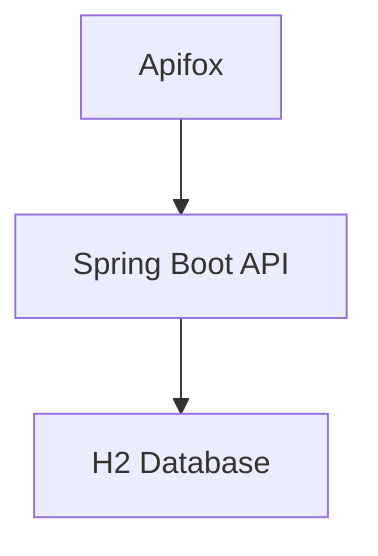
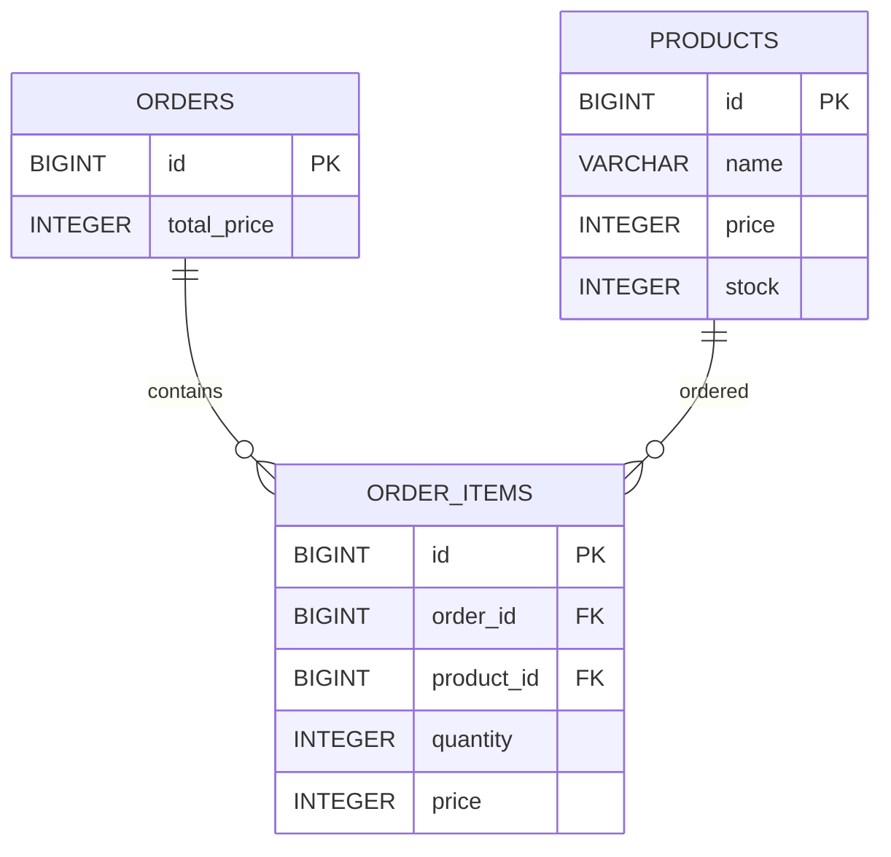
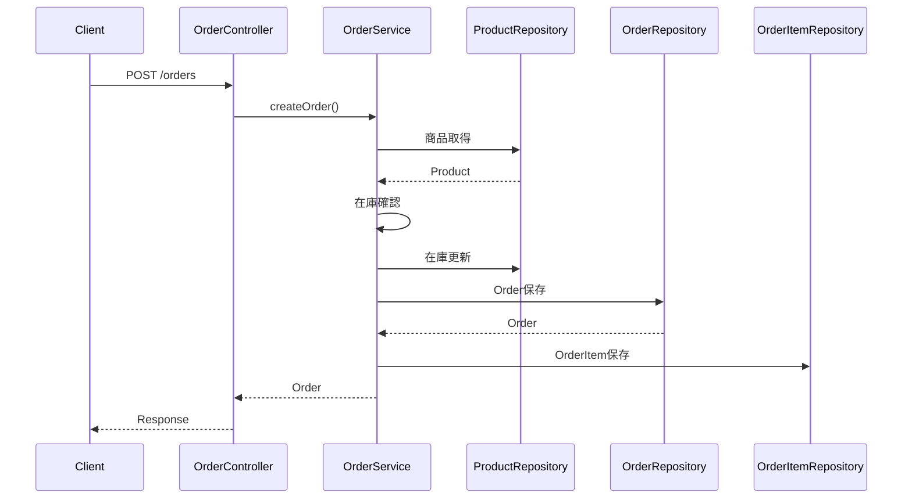

# 在庫管理・注文システム（Spring Boot）

## 📌 概要

Spring Bootを用いて開発した在庫管理・注文管理システムです。

商品の登録・更新・削除だけでなく、注文時の在庫減算や合計金額計算などの業務ロジックを実装しています。

実務を意識し、トランザクション管理や例外ハンドリングによるデータ整合性の確保も行っています。

---

## 🎯 開発目的

- Spring BootによるREST API開発の習得
- JPAを利用したデータベース操作の理解
- 業務ロジックを含むバックエンド設計の経験
- トランザクション管理による整合性確保
- ポートフォリオとして公開するため

---

## 🛠 使用技術

| 分類 | 技術 |
|--------|--------|
| Language | Java 17 |
| Framework | Spring Boot 3 |
| ORM | Spring Data JPA |
| Database | H2 Database |
| Build Tool | Maven |
| Utility | Lombok |
| API Test | Apifox |
| Version Control | Git / GitHub |

---

## 🏗 システム構成



---

## 📂 プロジェクト構成

```text
src/main/java/com/example/demo
├── controller
│   ├── ProductController
│   ├── OrderController
│   └── OrderRequest
│
├── service
│   ├── ProductService
│   └── OrderService
│
├── repository
│   ├── ProductRepository
│   ├── OrderRepository
│   └── OrderItemRepository
│
├── entity
│   ├── Product
│   ├── Order
│   └── OrderItem
│
├── exception
│   ├── OutOfStockException
│   └── GlobalExceptionHandler
│
└── DemoApplication
```

---

## 🏗 ER図



---

## 📦 products

商品情報を管理します。

| カラム | 説明 |
|----------|----------|
| id | 商品ID |
| name | 商品名 |
| price | 商品価格 |
| stock | 在庫数 |

---

## 🧾 orders

注文情報を管理します。

| カラム | 説明 |
|----------|----------|
| id | 注文ID |
| total_price | 合計金額 |

---

## 📄 order_items

注文明細を管理します。

| カラム | 説明 |
|----------|----------|
| id | 明細ID |
| order_id | 注文ID |
| product_id | 商品ID |
| quantity | 購入数 |
| price | 注文時単価 |

---

## 💡 設計意図

### Order と OrderItem を分離した理由

1つの注文で複数の商品を購入できるようにするため、1対多の関係で設計しています。

---

### 注文時価格を保持する理由

商品価格は変更される可能性があります。

注文時点の価格を保持することで、後から価格変更があった場合でも過去の注文履歴の整合性を維持できます。

---

### totalPriceを保持する理由

注文一覧取得時に毎回集計処理を行わないよう、注文作成時に計算して保存しています。

パフォーマンス向上を意識した設計です。

---

## 🔄 注文処理シーケンス



---

## 🔐 トランザクション管理

注文処理は `@Transactional` により管理しています。

```java
@Transactional
public Order createOrder(OrderRequest request)
```

処理途中でエラーが発生した場合はロールバックされ、データ整合性を維持します。

---

## ⚠️ 例外ハンドリング

`@RestControllerAdvice` を利用して例外を一元管理しています。

### 在庫不足

```json
{
  "code": "OUT_OF_STOCK",
  "message": "在庫が不足しています"
}
```

---

### 商品未存在

```json
{
  "code": "PRODUCT_NOT_FOUND",
  "message": "商品が存在しません"
}
```

---

## 📡 API一覧

### 商品API

| 内容 | Method | URL |
|--------|--------|--------|
| 一覧取得 | GET | /products |
| 単体取得 | GET | /products/{id} |
| 登録 | POST | /products |
| 更新 | PUT | /products/{id} |
| 削除 | DELETE | /products/{id} |

---

### 注文API

| 内容 | Method | URL |
|--------|--------|--------|
| 注文作成 | POST | /orders |
| 一覧取得 | GET | /orders |

---

## 📥 リクエスト例

### 商品登録

```json
{
  "name": "りんご",
  "price": 300,
  "stock": 10
}
```

---

### 注文作成

```json
{
  "productId": 1,
  "quantity": 2
}
```

---

## 📤 レスポンス例

### 商品取得

```json
{
  "id": 1,
  "name": "りんご",
  "price": 300,
  "stock": 8
}
```

---

### 注文作成

```json
{
  "id": 1,
  "totalPrice": 600
}
```

---

## 🧪 動作確認

### 商品登録

```http
POST /products
```

---

### 商品一覧取得

```http
GET /products
```

---

### 商品単体取得

```http
GET /products/1
```

---

### 注文作成

```http
POST /orders
```

---

### 注文一覧取得

```http
GET /orders
```

---

## 🖥 H2 Console

```text
http://localhost:8080/h2-console
```

設定

```text
JDBC URL:
jdbc:h2:file:./data/testdb

User:
sa

Password:
（空）
```

---

## 🚀 起動方法

### クローン

```bash
git clone <repository-url>
```

### プロジェクト移動

```bash
cd demo
```

### 起動

```bash
./mvnw spring-boot:run
```

---

## 📚 学んだこと

- REST API設計
- Spring Bootによるバックエンド開発
- Spring Data JPAによるDB操作
- トランザクション管理
- 例外ハンドリング
- テーブル正規化
- エンティティリレーション設計

---

## 🔮 今後の改善予定

- DTO導入
- JUnitテスト追加
- Docker対応
- MySQL対応
- AWSデプロイ（EC2）
- Terraform導入
- JWT認証機能追加
- Reactフロントエンド実装

---

## 👤 作者

Portfolio Project by Iwamoto
