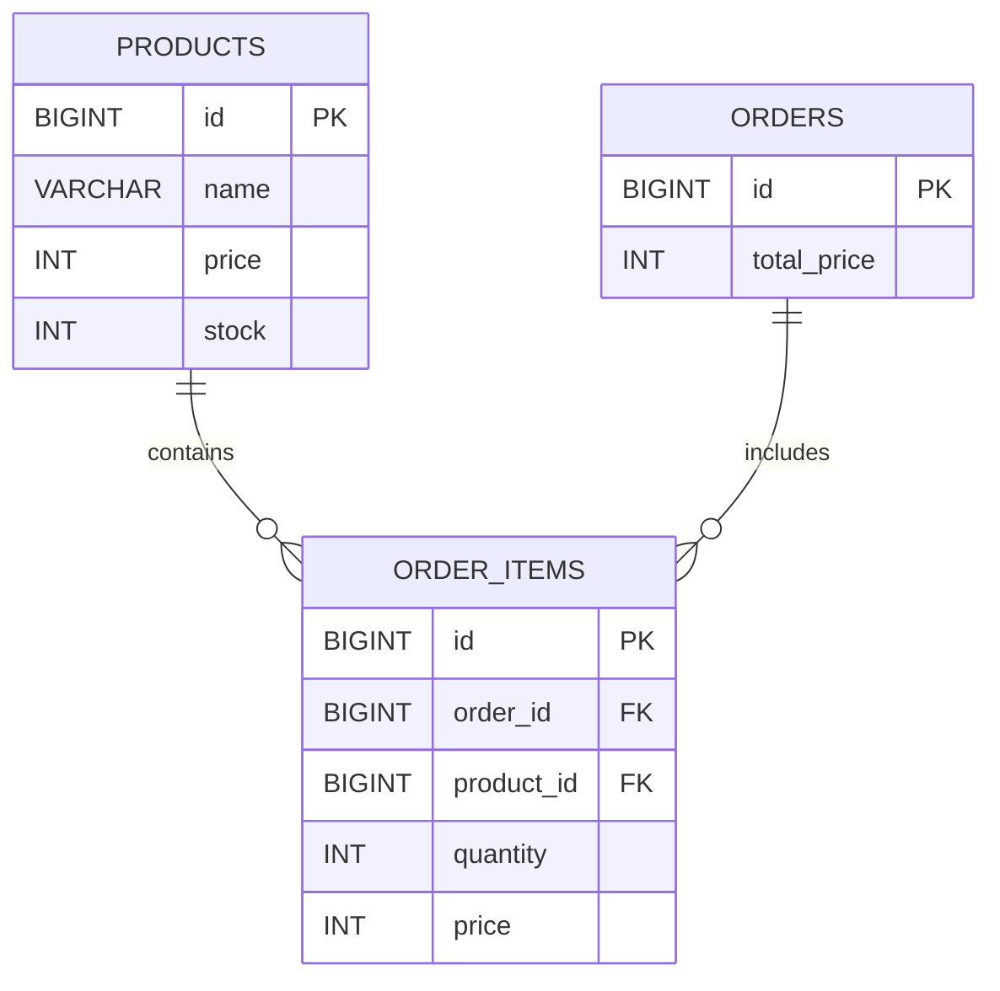

# 在庫管理・注文システム（Spring Boot）

## 📌 概要

Spring Bootを用いて開発した在庫管理・注文管理システムです。

商品の登録・更新・削除だけでなく、注文時の在庫減算や合計金額計算などの業務ロジックを実装しています。

実務で利用される構成を意識し、Controller・Service・Repositoryの責務分離やトランザクション管理、例外ハンドリングを取り入れています。

---

## 🎯 開発目的

- Spring BootによるREST API開発の学習
- 実務を意識したレイヤードアーキテクチャの理解
- トランザクション管理によるデータ整合性の確保
- JPAによるデータベース操作の習得
- 例外ハンドリング設計の習得

---

## 🛠 使用技術

| 技術 | バージョン |
|--------|--------|
| Java | 17 |
| Spring Boot | 3.5 |
| Spring Web | - |
| Spring Data JPA | - |
| H2 Database | - |
| Maven | - |
| Lombok | - |

---

## 🏗 システム構成

```text
Client
 ↓
Controller
 ↓
Service
 ↓
Repository
 ↓
H2 Database
```

---

## 📁 ディレクトリ構成

```text
src
 └─ main
     └─ java
         └─ com.example.demo
              ├─ controller
              ├─ entity
              ├─ repository
              ├─ service
              └─ exception
```

---

## 🧩 ER図



---

## 💡 設計上の工夫

### Order と OrderItem を分離

1つの注文で複数の商品を購入できることを想定し、正規化を行っています。

---

### 注文時価格の保持

商品価格が変更されても過去注文の金額が変わらないよう、注文時の価格を保存しています。

---

### totalPriceの保持

毎回集計計算を行わず、注文作成時に保存することでパフォーマンスを向上させています。

---

## 🔄 トランザクション管理

注文処理では以下を1つのトランザクションとして管理しています。

1. 在庫確認
2. 在庫減算
3. 注文作成
4. 注文明細作成

```java
@Transactional
public Order createOrder(OrderRequest request)
```

処理途中でエラーが発生した場合はロールバックされ、データ不整合を防止します。

---

## ⚠️ 例外ハンドリング

`@RestControllerAdvice` を使用して例外を一元管理しています。

### 在庫不足時

```json
{
  "code": "OUT_OF_STOCK",
  "message": "在庫が不足しています"
}
```

### 対応例外

- 在庫不足
- 商品未存在
- 想定外エラー

---

## 📡 API一覧

### 商品API

| 内容 | メソッド | パス |
|--------|--------|--------|
| 一覧取得 | GET | /products |
| 詳細取得 | GET | /products/{id} |
| 登録 | POST | /products |
| 更新 | PUT | /products/{id} |
| 削除 | DELETE | /products/{id} |

---

### 注文API

| 内容 | メソッド | パス |
|--------|--------|--------|
| 注文作成 | POST | /orders |
| 一覧取得 | GET | /orders |

---

## 📷 実行画面

### 商品一覧取得


---

### 商品詳細取得


---

### 注文作成成功

注文時に在庫減算と合計金額計算を実施しています。


---

### 在庫不足エラー

独自例外と GlobalExceptionHandler により統一フォーマットで返却しています。


---

### H2 Database

注文作成後、在庫減算・注文・注文明細が正しく保存されていることを確認できます。


---

## 🚀 セットアップ

### リポジトリ取得

```bash
git clone https://github.com/utl-flaxy/inventory-management-system.git
```

### プロジェクト移動

```bash
cd inventory-management-system
```

### 起動

```bash
./mvnw spring-boot:run
```

---

## 🖥 H2 Console

URL

```text
http://localhost:8080/h2-console
```

接続情報

```text
JDBC URL : jdbc:h2:file:./data/testdb
User Name : sa
Password : （空）
```

---

## 🧪 動作確認

### 商品登録

```http
POST /products
```

```json
{
  "name": "りんご",
  "price": 300,
  "stock": 10
}
```

---

### 注文作成

```http
POST /orders
```

```json
{
  "productId": 1,
  "quantity": 2
}
```

---

## 📚 学んだこと

- REST API設計
- Spring Bootのレイヤードアーキテクチャ
- JPAによるデータ操作
- トランザクション管理
- 例外ハンドリング設計
- 正規化を意識したER設計

---

## 🔮 今後の改善予定

- DTO導入
- JUnitによるテストコード追加
- Docker対応
- MySQL対応
- AWSデプロイ（EC2 / RDS）
- TerraformによるIaC化
- JWT認証機能追加
- Reactフロントエンド実装

---
