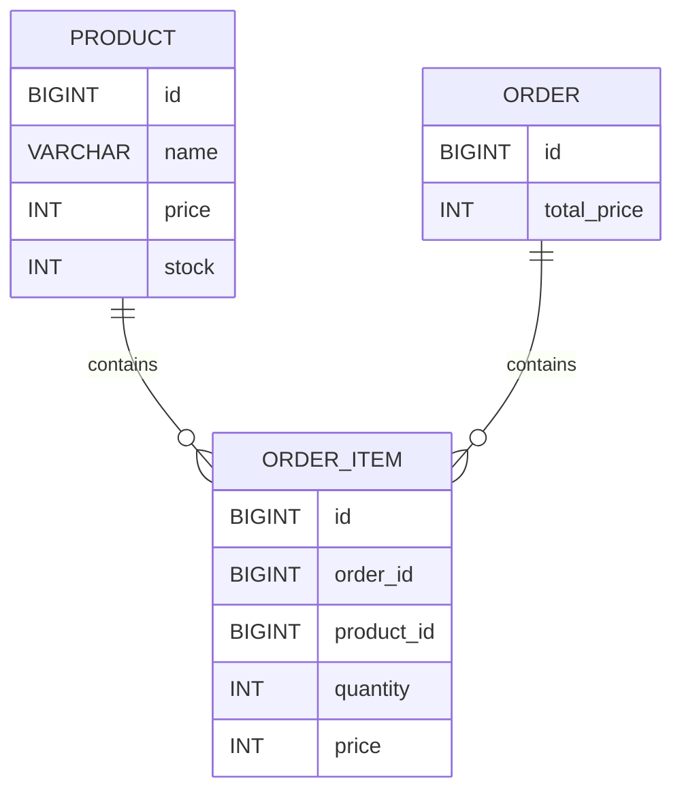

# 在庫管理・注文システム（Spring Boot）

## 📌 概要

Spring Bootを用いて開発した在庫管理・注文管理システムです。

商品の登録・更新・削除だけでなく、注文時の在庫減算や合計金額計算などの業務ロジックを実装しています。

実務を意識し、Controller・Service・Repositoryの責務分離、DTO、Validation、例外ハンドリング、トランザクション管理、テストコード、Docker、CI/CDを導入しています。

---

# 🎯 開発目的

* Spring BootによるREST API開発
* レイヤードアーキテクチャの理解
* DTOを用いた責務分離
* トランザクション管理による整合性維持
* JPAによるデータ操作
* テストコードの実装
* Dockerによるコンテナ化
* GitHub ActionsによるCI構築

---

# 🛠 使用技術

| 分類              | 技術               |
| --------------- | ---------------- |
| Language        | Java17           |
| Framework       | Spring Boot 3    |
| ORM             | Spring Data JPA  |
| Database        | MariaDB          |
| Build Tool      | Maven            |
| Utility         | Lombok           |
| Validation      | Bean Validation  |
| API Document    | Swagger(OpenAPI) |
| Test            | JUnit5           |
| Mock            | Mockito          |
| API Test        | MockMvc          |
| Container       | Docker           |
| CI              | GitHub Actions   |
| Version Control | Git / GitHub     |

---

# 🏗 システム構成

```text
Client
 ↓
Controller
 ↓
Service
 ↓
Repository
 ↓
MariaDB
```

---

# 📁 ディレクトリ構成

```text
src
├─main
│  └─java
│      └─com.example.demo
│          ├─controller
│          ├─dto
│          ├─entity
│          ├─exception
│          ├─repository
│          └─service
│
└─test
    └─java
        └─com.example.demo
            ├─controller
            └─service
```

---

# 🧩 ER図



---

# 💡 設計上の工夫

## OrderとOrderItemを分離

1つの注文に複数の商品が紐付く構造を想定し、正規化を行っています。

## 注文時価格を保持

商品価格変更後も過去注文の金額が変わらないよう、OrderItemに価格を保持しています。

## totalPrice保持

集計計算を毎回行わず、注文時に保存することでパフォーマンスを向上させています。

## DTOを利用

Entityをそのまま公開せず、

* ProductRequest
* ProductResponse

を用いて責務を分離しています。

---

# 🔄 トランザクション管理

注文処理を1つのトランザクションで実行しています。

1. 商品取得
2. 在庫確認
3. 在庫減算
4. 注文作成
5. 注文明細作成

```java
@Transactional
public Order createOrder(OrderRequest request)
```

途中でエラーが発生した場合はロールバックされ、データ不整合を防止します。

---

# ⚠️ 例外ハンドリング

@RestControllerAdvice を使用して例外を一元管理しています。

### 在庫不足

```json
{
  "code": "OUT_OF_STOCK",
  "message": "在庫が不足しています"
}
```

### 想定外エラー

```json
{
  "code": "SYSTEM_ERROR",
  "message": "..."
}
```

---

# ✅ Validation

Bean Validationを利用して入力チェックを実装しています。

* 商品名必須
* 金額は1以上
* 在庫数は0以上

不正なリクエストは400 Bad Requestを返します。

---

# 📡 API一覧

## Product API

| Method | URL            | 内容     |
| ------ | -------------- | ------ |
| GET    | /products      | 商品一覧取得 |
| GET    | /products/{id} | 商品詳細取得 |
| POST   | /products      | 商品登録   |
| PUT    | /products/{id} | 商品更新   |
| DELETE | /products/{id} | 商品削除   |

## Order API

| Method | URL     | 内容     |
| ------ | ------- | ------ |
| POST   | /orders | 注文作成   |
| GET    | /orders | 注文一覧取得 |

---

# 📘 Swagger

```text
http://localhost:8080/swagger-ui/index.html
```

---

# 🐳 Docker

起動

```bash
docker compose up -d
```

停止

```bash
docker compose down
```

確認

```bash
docker ps
```

---

# 🧪 テスト

## MockMvc

ProductControllerTest

* 商品一覧取得
* 商品詳細取得
* 商品登録
* 商品更新
* Validationエラー

## Mockito

OrderServiceTest

* 注文成功
* 在庫不足
* 商品不存在

```bash
./mvnw clean test
```

実行結果

```text
Tests run: 8
Failures: 0
Errors: 0
BUILD SUCCESS
```

---

# 🚀 CI/CD

GitHub Actionsによってpush時に自動テストを実行しています。

```yaml
./mvnw clean test
```

ビルド失敗時にはGitHub上で検知できます。

---

# 📷 実行画面

### Swagger


### 商品一覧取得


### 注文成功


### 在庫不足


---

# 📚 学んだこと

* REST API設計
* レイヤードアーキテクチャ
* DTOによる責務分離
* Bean Validation
* ExceptionHandler
* JPAによるDB操作
* トランザクション管理
* Mockitoによる単体テスト
* MockMvcによるAPIテスト
* Dockerによるコンテナ化
* GitHub ActionsによるCI構築

---

# 🔮 今後の改善予定

* 複数商品注文対応
* AWS EC2デプロイ
* Amazon RDS
* Spring Security + JWT認証
* Reactフロントエンド実装
* TerraformによるIaC化
* ALB + Route53 + HTTPS化
